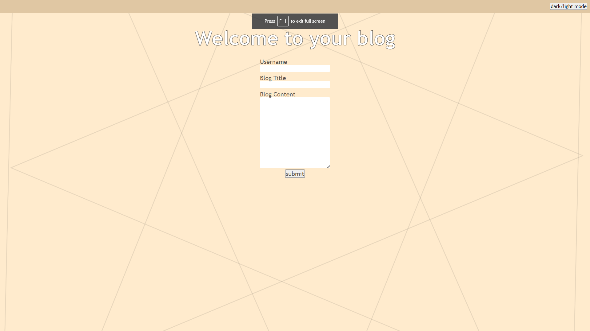
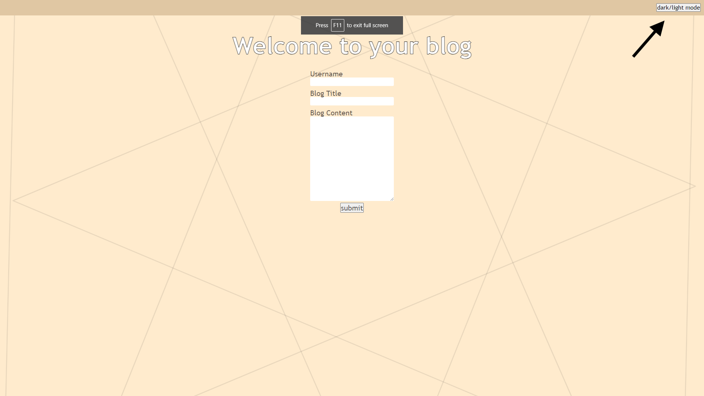
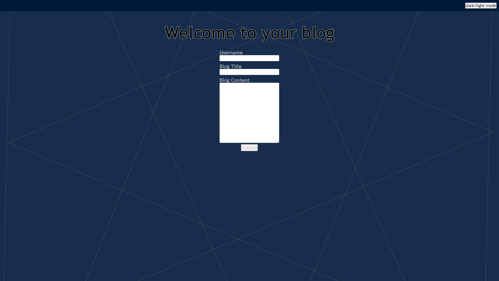
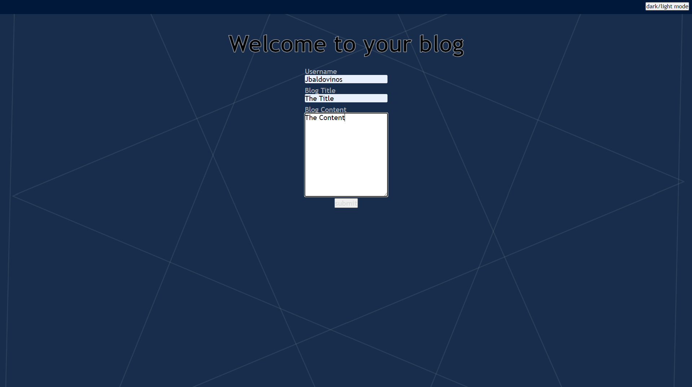
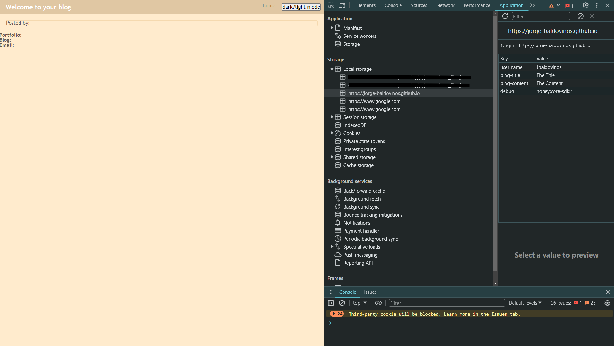

# Two Page Blog

## Description
This blog [website](https://jorge-baldovinos.github.io/Two-Page-Blog/index.html) displays user-submitted blogs on a separate screen after entering a username, blog title, and content. The blog also offers a dark mode feature for the user's convenience. 

## Usage

The user is initially greeted with a screen that accepts blog entries by requesting a username, blog title, and blog content.

On the top right corner, the user can find a dark mode button. 

By pressing the button, the user can toggle between dark mode and light mode.

The user can insert text into the input fields and press submit.

Once the user submits the info, the data will be stored in Local Storage and accessible to create a blog post on a second screen.

## License

Please refer to the LICENSE in the repo.
